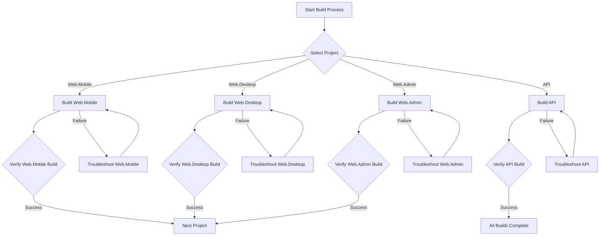

# Design Document - Processo de Build do Projeto Barbearia SaaS

## Overview

Este documento detalha a abordagem de design para o processo de build de cada projeto do sistema Barbearia SaaS, focando em garantir que cada aplicação compile e esteja pronta para execução, seguindo a ordem de prioridade definida: Web.Mobile, Web.Desktop, Web.Admin e, por fim, a API. O objetivo é resolver os problemas de build de forma sistemática, aplicando as melhores práticas para cada tecnologia.

## Architecture

### High-Level Build Flow

### Technology Stack and Build Tools

| Project | Technology | Build Tool | Key Configuration Files | Common Build Issues |
|---|---|---|---|---|
| **Web.Mobile** | Angular (PWA) | npm / Angular CLI | `package.json`, `angular.json`, `tsconfig.json` | `main.ts` missing, SCSS import paths, TypeScript errors, Angular Material module imports, HTML escaping. |
| **Web.Desktop** | Angular | npm / Angular CLI | `package.json`, `angular.json`, `tsconfig.json` | SCSS import paths, TypeScript errors, Angular Material module imports, HTML escaping. |
| **Web.Admin** | Blazor Server | .NET CLI (`dotnet`) | `.csproj` | Sass deprecation warnings, `System.Text.Json` vulnerabilities. |
| **API** | .NET Core 8 | .NET CLI (`dotnet`) | `.csproj` | (To be determined, likely similar to Web.Admin) |

## Build Process Design

### 1. Web.Mobile (Angular PWA)

#### Approach
O processo de build para o Web.Mobile focará na resolução de problemas de configuração do Angular CLI, caminhos de importação de SCSS e erros de TypeScript. A ausência do `main.ts` será a prioridade máxima.

#### Detailed Steps (High-Level)
- **Verificação de `main.ts`:** Confirmar a existência e, se ausente, investigar a causa ou criar um arquivo básico.
- **Ajuste de Caminhos SCSS:** Corrigir os `@import` relativos nos arquivos `.scss` dos componentes.
- **Correção de Erros TypeScript:** Analisar e corrigir erros de tipagem e módulos não encontrados.
- **Tratamento de Erros HTML:** Escapar caracteres especiais (`@`) em templates HTML.
- **Importação de Módulos Angular Material:** Garantir que todos os módulos necessários sejam importados nos `NgModule`s apropriados.

### 2. Web.Desktop (Angular)

#### Approach
Similar ao Web.Mobile, o build do Web.Desktop abordará os problemas remanescentes de SCSS, TypeScript, HTML e Angular Material.

#### Detailed Steps (High-Level)
- **Ajuste de Caminhos SCSS:** Corrigir os `@import` relativos nos arquivos `.scss` dos componentes.
- **Correção de Erros TypeScript:** Analisar e corrigir erros de tipagem e módulos não encontrados (ex: `dashboard.module`).
- **Tratamento de Erros HTML:** Escapar caracteres especiais (`@`) em templates HTML.
- **Importação de Módulos Angular Material:** Garantir que todos os módulos necessários sejam importados nos `NgModule`s apropriados.

### 3. Web.Admin (Blazor Server)

#### Approach
Este projeto já compila. O design do processo de build para o Web.Admin focará em manter a estabilidade e documentar os avisos existentes.

#### Detailed Steps (High-Level)
- **Verificação de Build:** Confirmar que o `dotnet build` continua a ser bem-sucedido.
- **Documentação de Avisos:** Registrar os avisos de segurança (`System.Text.Json`) e depreciação de Sass para tratamento futuro.

### 4. API (.NET Core 8)

#### Approach
O build da API será direto, focando na compilação do projeto .NET Core 8.

#### Detailed Steps (High-Level)
- **Localização do Projeto:** Utilizar o caminho `src/Api/Presentation/Barbearia.Api/Barbearia.Api.csproj` para o build.
- **Execução do Build:** `dotnet build` no projeto da API.

## Error Handling Strategy

Para cada projeto, a estratégia de tratamento de erros será iterativa:
1.  **Análise do Erro:** Identificar a causa raiz do erro a partir da saída do build.
2.  **Proposta de Solução:** Desenvolver uma solução específica para o erro.
3.  **Implementação:** Aplicar a correção no código ou configuração.
4.  **Re-build e Verificação:** Executar o build novamente para confirmar a resolução.
5.  **Documentação:** Registrar o erro e a solução no `tasks.md` (e, se aplicável, no código).

## Testing Strategy (Build Verification)

Após cada build bem-sucedido, será realizada uma verificação básica para garantir que o projeto está em um estado executável. Testes mais aprofundados (unitários, E2E) serão abordados em fases posteriores, conforme o `README.md` e `ArquiteturaProjeto.md` indicam que estão "Em Desenvolvimento".

## Performance Considerations (Build Time)

Otimizações de tempo de build serão consideradas se o processo se tornar excessivamente longo, mas a prioridade inicial é a correção funcional.

## Security Considerations (Build Process)

Será garantido que o processo de build não introduza vulnerabilidades conhecidas (ex: dependências desatualizadas). Avisos de segurança (como os do `System.Text.Json`) serão notados para resolução futura.
