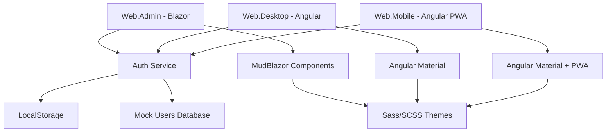

# Design Document - Telas de Login Multi-Frontend

## Overview

Este documento define o design técnico para implementação de três telas de login distintas no sistema Barbearia SaaS. Cada frontend (Web.Admin, Web.Desktop, Web.Mobile) terá sua própria implementação otimizada, mas compartilhará componentes de autenticação simulada e padrões de design consistentes baseados em Material Design.

## Architecture

### High-Level Architecture



### Technology Stack per Frontend

| Frontend | Framework | UI Library | Styling | State Management |
|----------|-----------|------------|---------|------------------|
| Web.Admin | Blazor Server | MudBlazor | Sass/SCSS | Component State |
| Web.Desktop | Angular 17+ | Angular Material | Sass/SCSS | RxJS + Services |
| Web.Mobile | Angular 17+ PWA | Angular Material | Sass/SCSS | RxJS + Services |

## Components and Interfaces

### 1. Authentication Service (Shared Logic)

```typescript
interface IAuthService {
  login(email: string, password: string): Promise<AuthResult>;
  logout(): void;
  isAuthenticated(): boolean;
  getCurrentUser(): User | null;
  getToken(): string | null;
}

interface AuthResult {
  success: boolean;
  token?: string;
  user?: User;
  error?: string;
}

interface User {
  id: string;
  email: string;
  name: string;
  role: 'admin' | 'barbeiro' | 'cliente';
  tenantId?: string;
}
```

### 2. Mock Users Database

```typescript
const MOCK_USERS = [
  {
    id: 'admin-001',
    email: 'guelfi@msn.com',
    password: '@5ST73EA4x',
    name: 'Administrador SaaS',
    role: 'admin',
    tenantId: 'saas-admin'
  },
  {
    id: 'barbeiro-001',
    email: 'barbeiro@barbearia.com',
    password: 'Barbeiro123!',
    name: 'João Silva',
    role: 'barbeiro',
    tenantId: 'tenant-001'
  },
  {
    id: 'cliente-001',
    email: 'cliente@email.com',
    password: 'Cliente123!',
    name: 'Maria Santos',
    role: 'cliente',
    tenantId: 'tenant-001'
  }
];
```

### 3. Component Structure

#### Web.Admin (Blazor)
```
Components/
├── Auth/
│   ├── LoginPage.razor
│   ├── LoginForm.razor
│   └── DevelopmentPage.razor
├── Shared/
│   ├── PasswordToggle.razor
│   └── LoadingSpinner.razor
└── Services/
    └── AuthService.cs
```

#### Web.Desktop & Web.Mobile (Angular)
```
src/
├── app/
│   ├── auth/
│   │   ├── components/
│   │   │   ├── login/
│   │   │   ├── register/
│   │   │   └── development/
│   │   ├── services/
│   │   │   └── auth.service.ts
│   │   └── guards/
│   │       └── auth.guard.ts
│   ├── shared/
│   │   └── components/
│   └── core/
│       └── models/
```

## Data Models

### 1. Login Form Model

```typescript
interface LoginForm {
  email: string;
  password: string;
  showPassword: boolean;
  rememberMe?: boolean;
}

interface LoginValidation {
  email: {
    required: boolean;
    email: boolean;
  };
  password: {
    required: boolean;
    minLength: number;
  };
}
```

### 2. Registration Form Models

```typescript
interface BarbeariaRegistration {
  nomeBarbearia: string;
  emailResponsavel: string;
  senha: string;
  confirmarSenha: string;
  telefone: string;
  endereco: {
    cep: string;
    rua: string;
    numero: string;
    cidade: string;
    estado: string;
  };
}

interface ClienteRegistration {
  nome: string;
  email: string;
  senha: string;
  confirmarSenha: string;
  telefone: string;
}
```

### 3. Authentication State

```typescript
interface AuthState {
  isAuthenticated: boolean;
  user: User | null;
  token: string | null;
  loading: boolean;
  error: string | null;
}
```

## Error Handling

### Error Types and Messages

```typescript
enum AuthErrorType {
  INVALID_CREDENTIALS = 'INVALID_CREDENTIALS',
  USER_NOT_FOUND = 'USER_NOT_FOUND',
  NETWORK_ERROR = 'NETWORK_ERROR',
  VALIDATION_ERROR = 'VALIDATION_ERROR'
}

const ERROR_MESSAGES = {
  [AuthErrorType.INVALID_CREDENTIALS]: 'Email ou senha incorretos',
  [AuthErrorType.USER_NOT_FOUND]: 'Usuário não encontrado',
  [AuthErrorType.NETWORK_ERROR]: 'Erro de conexão. Tente novamente.',
  [AuthErrorType.VALIDATION_ERROR]: 'Dados inválidos. Verifique os campos.'
};
```

### Error Display Strategy

1. **Web.Admin**: Toast notifications usando MudBlazor
2. **Web.Desktop**: Snackbar usando Angular Material
3. **Web.Mobile**: Toast com feedback tátil (vibração)

## Testing Strategy

### Unit Tests
- Authentication service logic
- Form validation
- Component state management
- Mock user database operations

### Integration Tests
- Login flow end-to-end
- Registration flow simulation
- Navigation between screens
- LocalStorage persistence

### E2E Tests (Cypress)
- Complete user journeys
- Cross-browser compatibility
- Responsive design validation
- Performance metrics

### Test Data Strategy
```typescript
const TEST_SCENARIOS = {
  validLogin: {
    admin: { email: 'guelfi@msn.com', password: '@5ST73EA4x' },
    barbeiro: { email: 'barbeiro@barbearia.com', password: 'Barbeiro123!' },
    cliente: { email: 'cliente@email.com', password: 'Cliente123!' }
  },
  invalidLogin: {
    wrongPassword: { email: 'guelfi@msn.com', password: 'wrong' },
    wrongEmail: { email: 'wrong@email.com', password: '@5ST73EA4x' },
    emptyFields: { email: '', password: '' }
  }
};
```

## Design System and Styling

### Color Palette
```scss
// Primary Colors
$primary-admin: #512BD4;    // Admin SaaS
$primary-desktop: #DD0031;  // Desktop Barbearia
$primary-mobile: #FF6C37;   // Mobile Cliente

// Semantic Colors
$success: #28A745;
$warning: #FFC107;
$error: #DC3545;
$info: #17A2B8;

// Neutral Colors
$gray-50: #F8F9FA;
$gray-900: #212529;
```

### Typography Scale
```scss
$font-sizes: (
  xs: 0.75rem,   // 12px
  sm: 0.875rem,  // 14px
  base: 1rem,    // 16px
  lg: 1.125rem,  // 18px
  xl: 1.25rem,   // 20px
  2xl: 1.5rem,   // 24px
  3xl: 1.875rem  // 30px
);
```

### Component Specifications

#### Login Card
- **Width**: 400px (desktop), 100% - 32px (mobile)
- **Padding**: 32px
- **Border Radius**: 12px
- **Shadow**: Material Design elevation 8
- **Animation**: Fade in 300ms ease-out

#### Form Fields
- **Height**: 56px (touch-friendly)
- **Border Radius**: 8px
- **Focus State**: Primary color border + shadow
- **Error State**: Red border + error message below

#### Buttons
- **Primary**: Filled with primary color
- **Secondary**: Outlined with primary color
- **Height**: 48px (touch-friendly)
- **Border Radius**: 8px
- **Hover**: Elevation + color darkening

### Responsive Breakpoints
```scss
$breakpoints: (
  xs: 0,
  sm: 576px,
  md: 768px,
  lg: 992px,
  xl: 1200px,
  xxl: 1400px
);
```

## Performance Considerations

### Bundle Size Optimization
- **Lazy Loading**: Auth module loaded on demand
- **Tree Shaking**: Remove unused Material Design components
- **Code Splitting**: Separate bundles per frontend

### Runtime Performance
- **Virtual Scrolling**: For large user lists (future)
- **OnPush Change Detection**: Angular components
- **Memoization**: Expensive computations cached
- **Image Optimization**: WebP format with fallbacks

### PWA Specific (Web.Mobile)
- **Service Worker**: Cache auth assets
- **Offline Support**: Login with cached credentials
- **App Shell**: Instant loading architecture
- **Push Notifications**: Future feature preparation

## Security Considerations

### Client-Side Security
- **Input Sanitization**: XSS prevention
- **CSRF Protection**: Token-based (future API integration)
- **Secure Storage**: Encrypted localStorage for sensitive data
- **Session Management**: Auto-logout after inactivity

### Mock Authentication Security
- **Password Hashing**: Simulated bcrypt comparison
- **Rate Limiting**: Prevent brute force attempts
- **Token Expiration**: 1-hour simulated JWT expiry
- **Secure Headers**: CSP and security headers

## Deployment Strategy

### Build Configuration
```json
{
  "environments": {
    "development": {
      "mockAuth": true,
      "apiUrl": "http://localhost:5000"
    },
    "production": {
      "mockAuth": false,
      "apiUrl": "https://api.barbearia-saas.com"
    }
  }
}
```

### Asset Optimization
- **CSS**: Sass compilation + minification
- **Images**: Compression + WebP conversion
- **Fonts**: Subset + preload
- **Icons**: SVG sprite generation

### Progressive Enhancement
1. **Basic HTML Forms**: Work without JavaScript
2. **Enhanced UX**: JavaScript adds animations and validation
3. **PWA Features**: Service worker adds offline capability
4. **Advanced Features**: Biometric auth (future)